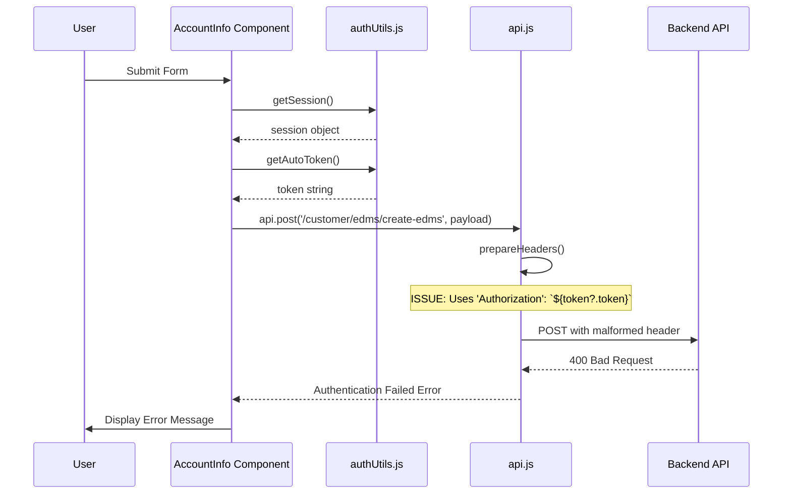
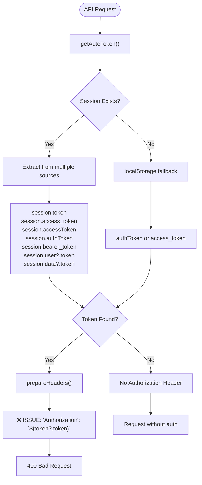
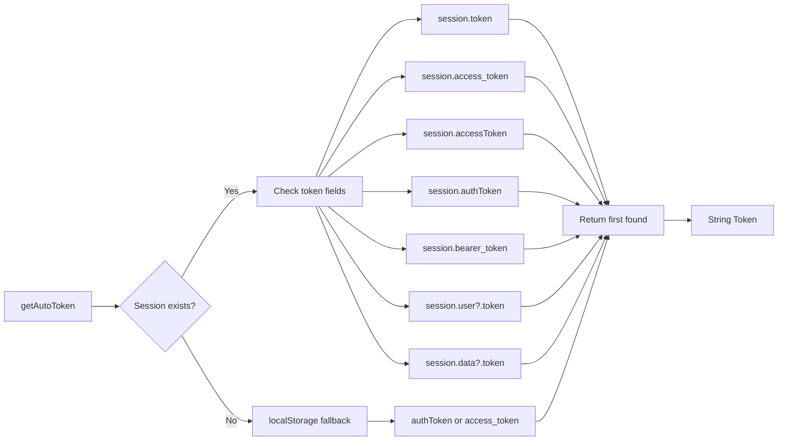
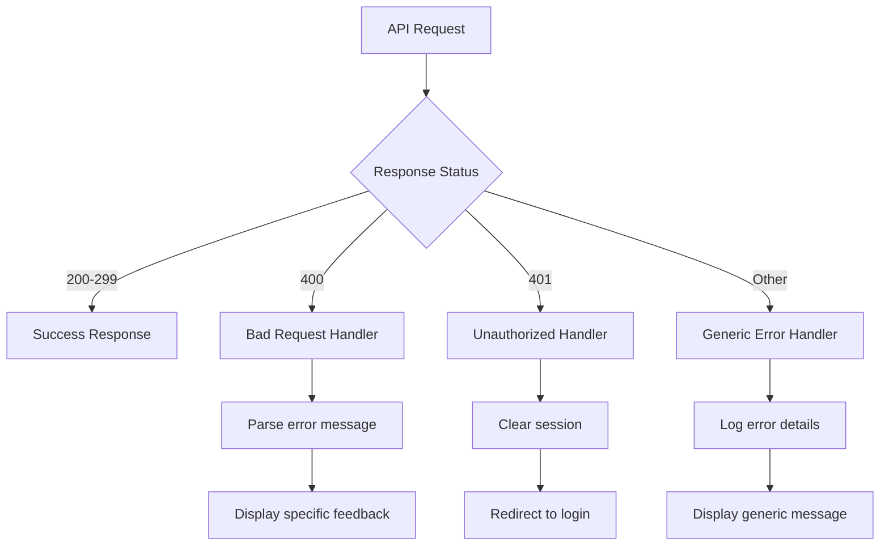

# Authentication Error Troubleshooting Design Document

## Overview

This document analyzes a critical authentication error occurring in the Visibeen frontend application where API requests fail with "400 Bad Request" and "Authentication Failed" errors due to incorrect authorization header formatting.

### Error Context
- **Error Type**: HTTP 400 Bad Request with "Authentication Failed" message
- **Root Cause**: Incorrect authorization header format using `${token?.token}` instead of `Bearer ${token}`
- **Affected Components**: AccountInfo.jsx, AccountInfoForm.jsx, CROInfoForm.jsx, GSTInfoForm.jsx
- **Impact**: Complete API authentication failure preventing form submissions

## Architecture Analysis

### Current Authentication Flow



### Token Management System



## Root Cause Analysis

### Primary Issue: Incorrect Authorization Header Format

**Current Implementation (Incorrect):**
```javascript
// In api.js line 62
if (token) {
    return {
        ...baseHeaders,
        'Authorization': `${token?.token}`,  // ❌ WRONG: Accessing .token property
        ...customHeaders
    };
}
```

**Expected Implementation:**
```javascript
if (token) {
    return {
        ...baseHeaders,
        'Authorization': `Bearer ${token}`,  // ✅ CORRECT: Bearer prefix with token string
        ...customHeaders
    };
}
```

### Secondary Issues

1. **Token Property Access**: The code assumes token is an object with a `.token` property, but `getAutoToken()` returns a string
2. **Missing Bearer Prefix**: Backend expects "Bearer [token]" format as per OAuth 2.0 standards
3. **Inconsistent Error Handling**: Mixed error response parsing between components

## Technical Specifications

### Authentication Header Standards

| Format | Usage | Example |
|--------|-------|---------|
| `Bearer ${token}` | ✅ OAuth 2.0 Standard | `Bearer eyJhbGciOiJIUzI1NiIs...` |
| `${token?.token}` | ❌ Current (Incorrect) | `undefined` (if token is string) |
| `${token}` | ⚠️ Missing Bearer | `eyJhbGciOiJIUzI1NiIs...` |

### Token Extraction Logic

The `getAutoToken()` function correctly returns a string token from multiple sources:



## Solution Architecture

### Fixed Header Preparation

```javascript
prepareHeaders(customHeaders = {}) {
    const token = this.getAutoToken();
    const baseHeaders = {
        'Content-Type': 'application/json',
    };

    if (token) {
        return {
            ...baseHeaders,
            'Authorization': `Bearer ${token}`, // ✅ FIXED: Proper Bearer format
            ...customHeaders
        };
    }

    return {
        ...baseHeaders,
        ...customHeaders
    };
}
```

### Error Handling Enhancement



## Implementation Requirements

### Critical Fix
1. **Update Authorization Header Format** in `api.js`
   - Change from `'Authorization': \`${token?.token}\`` 
   - To `'Authorization': \`Bearer ${token}\``

### Enhanced Error Handling
2. **Standardize Error Response Parsing**
   - Consistent error message extraction
   - Proper HTTP status code handling
   - User-friendly error messages

### Debugging Improvements  
3. **Enhanced Logging**
   - Token validation logging
   - Header inspection utilities
   - Request/response debugging

## Testing Strategy

### Unit Testing
```javascript
describe('ApiService Authentication', () => {
  test('should format authorization header correctly', () => {
    const mockToken = 'eyJhbGciOiJIUzI1NiIs...';
    const headers = apiService.prepareHeaders();
    expect(headers.Authorization).toBe(`Bearer ${mockToken}`);
  });
  
  test('should handle missing token gracefully', () => {
    // Mock getAutoToken to return null
    const headers = apiService.prepareHeaders();
    expect(headers.Authorization).toBeUndefined();
  });
});
```

### Integration Testing
- Test actual API calls with valid tokens
- Verify error handling for expired tokens
- Test token refresh mechanism

## Error Prevention Measures

### Code Review Checklist
- [ ] Authorization header uses "Bearer" prefix
- [ ] Token is treated as string, not object
- [ ] Error handling covers all HTTP status codes
- [ ] Logging includes token validation steps

### Development Guidelines
1. **Always use Bearer prefix** for OAuth 2.0 compliance
2. **Validate token format** before API calls
3. **Implement comprehensive error handling** for all endpoints
4. **Use centralized authentication utilities** consistently

## Monitoring & Diagnostics

### Debug Information
```javascript
console.log('[API] Request Details:', {
  url,
  method: config.method || 'GET',
  hasAuthHeader: !!config.headers?.Authorization,
  authHeaderFormat: config.headers?.Authorization?.startsWith('Bearer '),
  tokenLength: token?.length || 0
});
```

### Performance Impact
- **Minimal overhead**: String concatenation vs object property access
- **Reduced error rates**: Proper authentication prevents unnecessary retries
- **Improved UX**: Faster error resolution and clearer feedback

## Security Considerations

### Token Handling
- Tokens are stored securely in session/localStorage
- No token exposure in console logs (only length/presence)
- Automatic token refresh on 401 errors

### Authentication Flow
- Session validation before API calls
- Fallback mechanisms for token retrieval
- Secure session cleanup on authentication failure