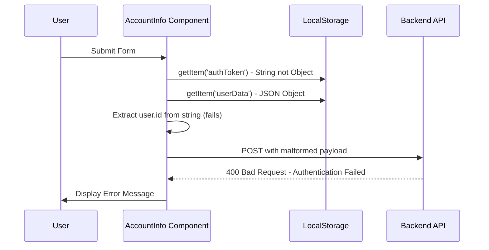
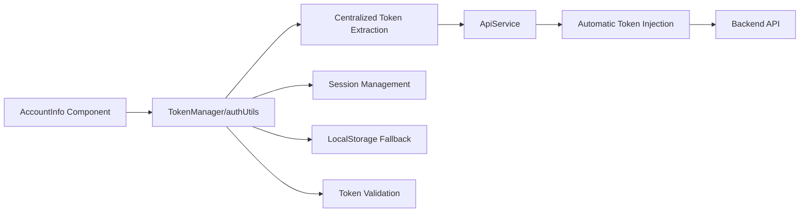
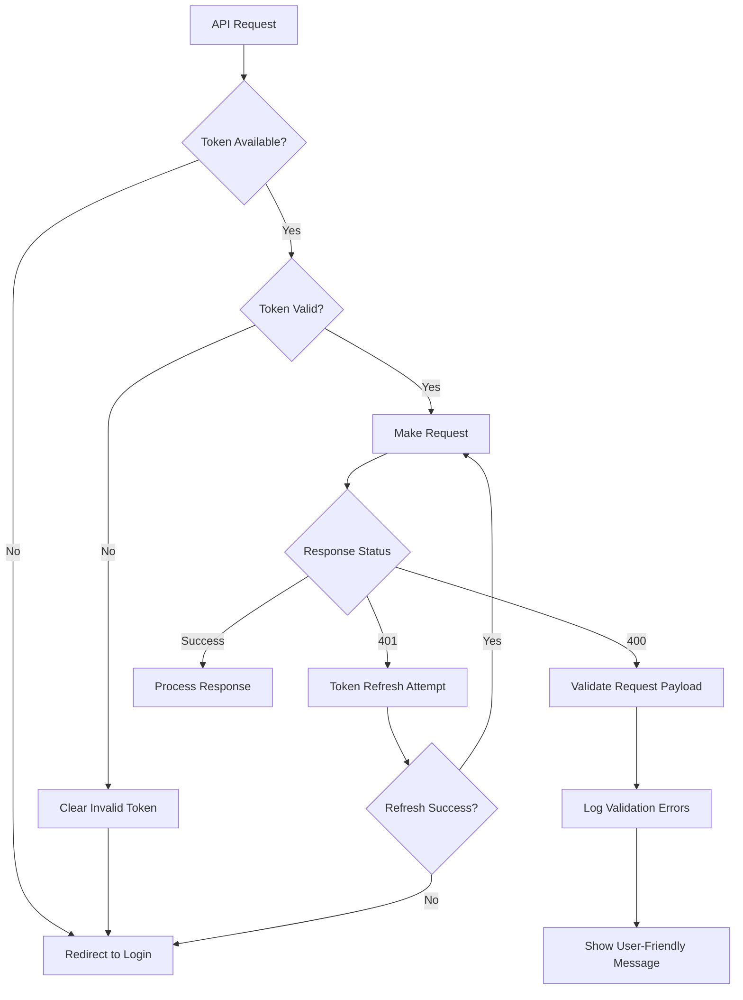
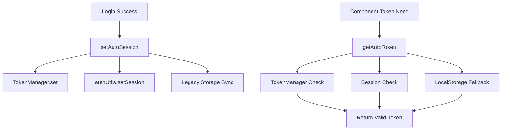
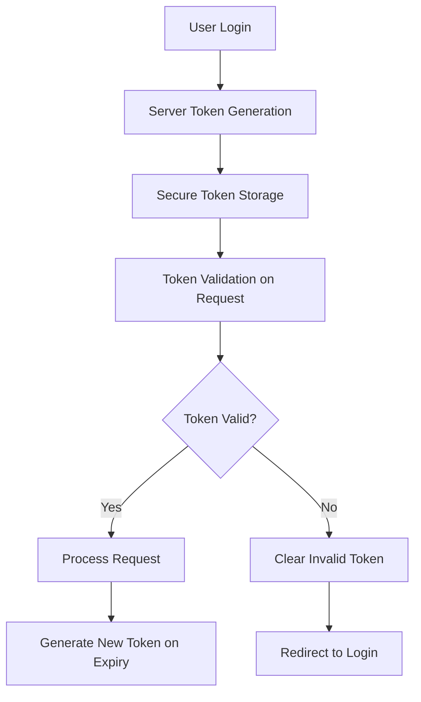

# Understanding HTTP 400 Bad Request Error - Authentication Failed

## Overview

This document analyzes the HTTP 400 Bad Request error occurring in the AccountInfo component when submitting EDMS (Electronic Direct Mail System) account information. The error indicates an authentication failure with the backend API, specifically when making POST requests to the `/api/v1/customer/edms/create-edms` endpoint.

## Error Context

The error occurs in the `AccountInfo.jsx` component within the `handleSaveAndNext` function when users attempt to save their account information and proceed to the next step in the EDMS workflow.

### Error Stack Trace Analysis

```
POST http://52.44.140.230:8089/api/v1/customer/edms/create-edms 400 (Bad Request)
Server responded with: {error: 'Authentication Failed', code: 400}
```

The error indicates that the server rejected the request due to authentication failure, returning a 400 status code instead of the expected 401 for authentication issues.

## Architecture

### Component Structure

```mermaid
graph TD
    A[AccountInfo Component] --> B[handleSaveAndNext Function]
    B --> C[Token Retrieval Process]
    C --> D[API Request Construction]
    D --> E[Backend API Endpoint]
    
    C --> F[localStorage.getItem('authToken')]
    C --> G[JSON.parse localStorage.getItem('userData')]
    
    F --> H[User ID Extraction Issue]
    G --> I[Token Format Issue]
    
    H --> J[Authentication Failure]
    I --> J
    J --> K[HTTP 400 Error]
```

### Authentication Flow Issues



## Root Cause Analysis

### Primary Issues

1. **Token Storage Inconsistency**
   - `authToken` is stored as a string but accessed as an object
   - `userData` is stored as JSON but contains the actual token
   - Mismatched token extraction logic

2. **User ID Extraction Error**
   ```javascript
   const user = (localStorage.getItem('authToken')); // Returns string
   const payload = {
     user_id: user?.id, // Undefined - string has no 'id' property
     // ... other fields
   };
   ```

3. **Authorization Header Format**
   ```javascript
   Authorization: `${token?.token}` // Missing 'Bearer ' prefix
   ```

### Token Management Problems

The application has multiple token storage mechanisms that are inconsistent:

```javascript
// Current problematic approach in AccountInfo.jsx
const user = localStorage.getItem('authToken');     // String value
const token = JSON.parse(localStorage.getItem('userData')); // Object with token
```

This conflicts with the established token management system that uses:
- `TokenManager` for centralized token handling
- `authUtils.js` for token extraction with multiple fallbacks
- `ApiService` for automatic token injection

## Solution Architecture

### Recommended Token Management Integration



### Enhanced Error Handling Flow



## Implementation Fixes

### 1. Token Extraction Correction

```javascript
// Instead of problematic approach
const user = localStorage.getItem('authToken');
const token = JSON.parse(localStorage.getItem('userData'));

// Use centralized token management
import { getSession, getAutoToken } from '../../utils/authUtils';

const session = getSession();
const authToken = getAutoToken();

const payload = {
  user_id: session?.id || session?.user?.id,
  // ... other fields
};
```

### 2. Proper Authorization Header

```javascript
// Instead of
Authorization: `${token?.token}`

// Use standard Bearer format
Authorization: `Bearer ${authToken}`
```

### 3. ApiService Integration

Replace direct axios calls with the centralized ApiService:

```javascript
// Instead of direct axios
import axios from 'axios';

// Use centralized API service
import api from '../../../services/api';

const response = await api.post('/customer/edms/create-edms', payload);
```

### 4. Enhanced Error Handling

```javascript
try {
  const response = await api.post('/customer/edms/create-edms', payload);
  console.log('API Response:', response.data);
  navigate('../upload-logo');
} catch (error) {
  if (error.response?.status === 401) {
    // Handle authentication error
    clearSession();
    navigate('/login');
  } else if (error.response?.status === 400) {
    // Handle bad request with specific feedback
    const errorMessage = error.response.data?.message || 'Invalid request data';
    console.error('Validation error:', errorMessage);
    setError(errorMessage);
  } else {
    console.error('API error:', error);
    setError('Something went wrong. Please try again.');
  }
}
```

## Token Storage Standardization

### Current Storage Patterns

The application currently uses multiple storage patterns:

| Storage Key | Type | Purpose | Issues |
|-------------|------|---------|---------|
| `authToken` | String | User authentication token | Accessed as object incorrectly |
| `userData` | JSON Object | Complete user data with token | Contains actual token |
| `user` | JSON Object | Session management | Part of authUtils system |

### Recommended Unified Approach



## Testing Strategy

### Unit Testing Requirements

1. **Token Extraction Tests**
   - Test `getAutoToken()` with various storage states
   - Test session retrieval with missing/corrupt data
   - Test fallback mechanisms

2. **API Integration Tests**
   - Mock 401 responses and verify token refresh
   - Mock 400 responses and verify error handling
   - Test payload construction with different user data

3. **Component Integration Tests**
   - Test form submission with valid authentication
   - Test form submission with expired tokens
   - Test form submission with missing user data

### Error Simulation Tests

```javascript
// Test cases for AccountInfo component
describe('AccountInfo Error Handling', () => {
  test('should handle missing authentication token', async () => {
    // Clear all storage
    localStorage.clear();
    sessionStorage.clear();
    
    // Attempt form submission
    // Expect redirect to login
  });
  
  test('should handle malformed user data', async () => {
    // Set invalid userData
    localStorage.setItem('userData', 'invalid-json');
    
    // Attempt form submission
    // Expect error handling
  });
  
  test('should handle 400 authentication failure', async () => {
    // Mock API to return 400 error
    // Verify error message display
  });
});
```

## Monitoring and Debugging

### Debug Information Collection

```javascript
// Add to AccountInfo component for debugging
const debugTokenInfo = () => {
  const session = getSession();
  const autoToken = getAutoToken();
  const authTokenRaw = localStorage.getItem('authToken');
  const userDataRaw = localStorage.getItem('userData');
  
  console.log('Token Debug Info:', {
    session: session ? 'Present' : 'Missing',
    autoToken: autoToken ? 'Present' : 'Missing',
    authTokenRaw: authTokenRaw ? 'Present (string)' : 'Missing',
    userDataRaw: userDataRaw ? 'Present (JSON)' : 'Missing',
    sessionValid: isSessionValid()
  });
};
```

### Error Tracking

```javascript
// Enhanced error logging
catch (error) {
  const errorInfo = {
    endpoint: '/api/v1/customer/edms/create-edms',
    status: error.response?.status,
    statusText: error.response?.statusText,
    errorData: error.response?.data,
    timestamp: new Date().toISOString(),
    userAgent: navigator.userAgent,
    userId: session?.id,
    hasToken: !!getAutoToken()
  };
  
  console.error('EDMS API Error:', errorInfo);
  
  // Send to error tracking service if available
  if (window.errorTracker) {
    window.errorTracker.track('edms_api_error', errorInfo);
  }
}
```

## Security Considerations

### Token Exposure Prevention

1. **Avoid Console Logging Tokens**
   - Never log complete tokens in production
   - Use masked tokens for debugging (first 10 characters + "...")

2. **Secure Storage Practices**
   - Prefer sessionStorage over localStorage for sensitive data
   - Implement token rotation for long-lived sessions

3. **Request Validation**
   - Validate all form data before API submission
   - Sanitize user inputs to prevent injection attacks

### Authentication Flow Security



## Migration Steps

### Phase 1: Fix Immediate Issues
1. Correct token extraction in AccountInfo.jsx
2. Fix authorization header format
3. Add proper error handling

### Phase 2: Integrate with Existing Token Management
1. Replace axios with ApiService
2. Use getAutoToken() for token extraction
3. Implement consistent error handling

### Phase 3: Standardize Across Application
1. Audit all components using localStorage tokens
2. Migrate to centralized token management
3. Remove redundant token storage patterns

### Phase 4: Enhanced Security and Monitoring
1. Implement comprehensive error tracking
2. Add token rotation mechanisms
3. Enhance security logging